# Модуль 1 
## Дополнительно:
В процессе настройки нам понадобится скачивать пакеты, и временно до того как настроим собственный днс сервер будем использовать общедоступный, в этой методичке днс сервер колледжа:
> `echo 'nameserver 192.168.100.1' >> /etc/resolv.conf`

Это временная настройка, после перезапуска сети или устройства она сотрется.

Если преднсатройка днс понадобится, то в параграфе будет об этом сказано

Так-же везде следует сразу же выполнить
> `apt-update`

при получении доступа в интернет и после прикручивания временного днс сервера, если этого не сделать иногда не удастся поставить пакеты

## 1. Произведите базовую настройку устройств
Настройте имена устройств согласно топологии. Используйте полное доменное имя.

На всех устройствах в соответствии с таблицей записей:

>`hostnamectl set-hostname hq-rtr.au-team.irpo`

IP-адрес должен быть из приватного диапазона, в случае, если сеть
локальная, согласно RFC1918

Локальная сеть в сторону HQ-SRV(VLAN100) должна вмещать не более 64 адресов
>`
Address:        172.16.100.1
Network:        172.16.100.0/26
Netmask:        255.255.255.192 = 26
Broadcast:      172.16.100.63
HostMin:        172.16.200.1
HostMax:        172.16.200.14
`

Локальная сеть в сторону HQ-CLI(VLAN200) должна вмещать не
более 16 адресов
>`
Address:        172.16.200.1
Network:        172.16.200.0/28
Netmask:        255.255.255.240 = 28
Broadcast:      172.16.200.15
HostMin:        172.16.200.1
HostMax:        172.16.200.14
`

Локальная сеть в сторону BR-SRV должна вмещать не более 32 адресов
>`
Address:        172.16.0.1
Network:        172.16.0.0/27
Netmask:        255.255.255.224 = 27
Broadcast:      172.16.0.31
HostMin:        172.16.0.1
HostMax:        172.16.0.30
`

Локальная сеть для управления(VLAN999) должна вмещать не
более 8 адресов
>`
Address:        172.16.99.1
Network:        172.16.99.0/29
Netmask:        255.255.255.248 = 29
Broadcast:      172.16.99.7
HostMin:        172.16.99.1
HostMax:        172.16.99.6
`

На всех устройствах необходимо сконфигурировать IPv4

Пример для HQ-SRV, на BR-SRV по аналогии
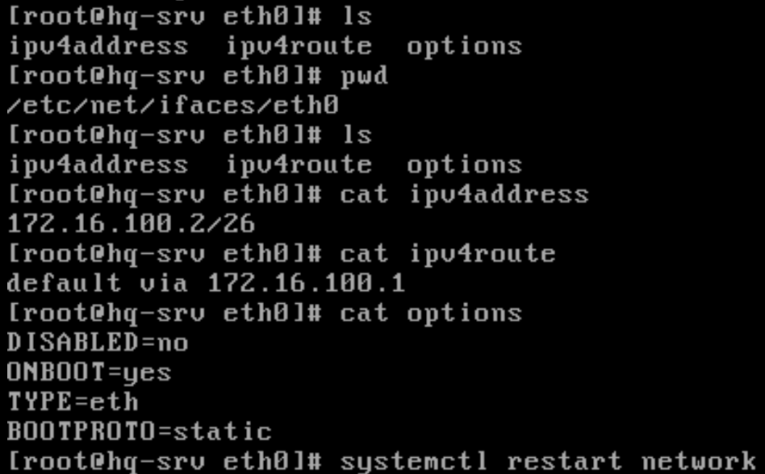

Настройка внешнего интерфейса к ISP на br-rtr, на hq-rtr так же но с другим адресом
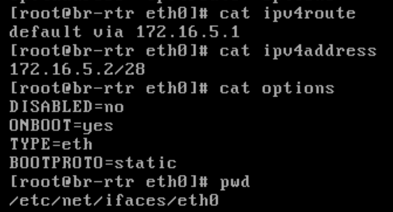

## 2. Настройка ISP
В /etc/net/ifaces/options/eth0

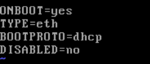

Интерфейс к hq-rtr имеет такие настройки в файлах
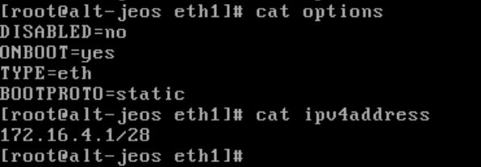

Интерфейс к br-rtr

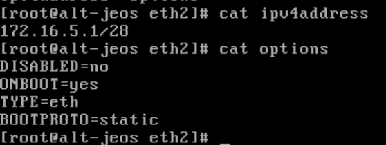

На ISP настройте динамическую сетевую трансляцию в сторону
HQ-RTR и BR-RTR для доступа к сети Интернет

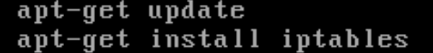
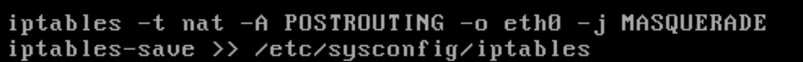
Так-же в файле /etc/net/sysctl.conf должна быть следующая строка 
> `net.ipv4.ip_forward = 1`

После всей настройки перезагрузим сеть:
>`systemctl restart network`

## 3. Создание локальных учетных записей
Везде добавить временный днс сервер перед настройкой и обновить репозиторий
**На HQ-SRV и BR-SRV**
>`apt-get install sudo -y
useradd -u 1010 sshuser
usermod -aG wheel sshuser
passwd sshuser
Дважды вводим P@ssw0rd
В файле /etc/sudoers раскомментить строку WHEEL_USERS ALL=(ALL:ALL) NOPASSWD: ALL
Примечание: при редактировании через что либо кроме visudo этот файл - ro, чтобы его записать в виме введите :wq!
`

Чтобы проверить, выйдите из-под root и зайдите как sshuser с ранее прописанным паролем, затем введите `sudo -i` и привилегии должны быть повышены без запроса пароля
**На HQ-RTR и BR-RTR**
>`apt-get install sudo -y
useradd net_admin
usermod -aG wheel net_admin
passwd net_admin
Дважды вводим P@ssw0rd
В файле /etc/sudoers раскомментить строку WHEEL_USERS ALL=(ALL:ALL) NOPASSWD: ALL`

Проверка такая-же но входить как net_admin
## 4. Настройте на интерфейсе HQ-RTR в сторону офиса HQ виртуальный коммутатор:
На hq-rtr в соответствии с интерфейсами в ip a создайте папки в /etc/net/ifaces/ а так же папки для интерфейсов vlan

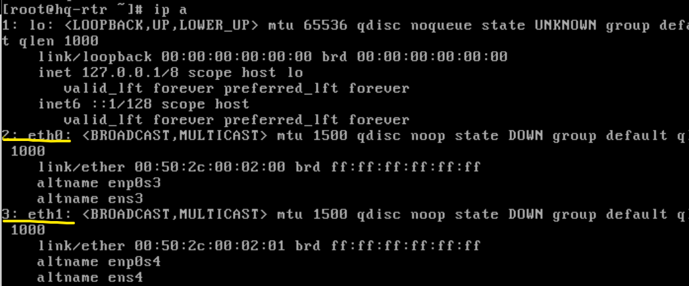
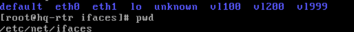
Интерфейсы vlan содержат соответсвующие настройки:
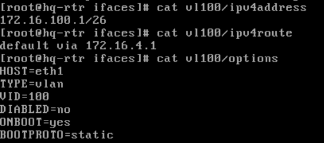
В соответсвии с назначением и айди влана поменяйте настройки в ipv4address и options (VID=VLAN_ID) для каждого вирутального интерфейса. Вот пример:
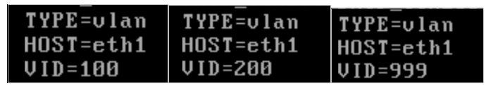
На HQ-RTR так-же нужно настроить в файле /etc/net/sysctl.conf 
> `net.ipv4.ip_forward = 1`

Перезагружаем сеть и выводим статус интерфейсов
>`
systemctl restart network
ip a
`

Должно выглядеть вот так:
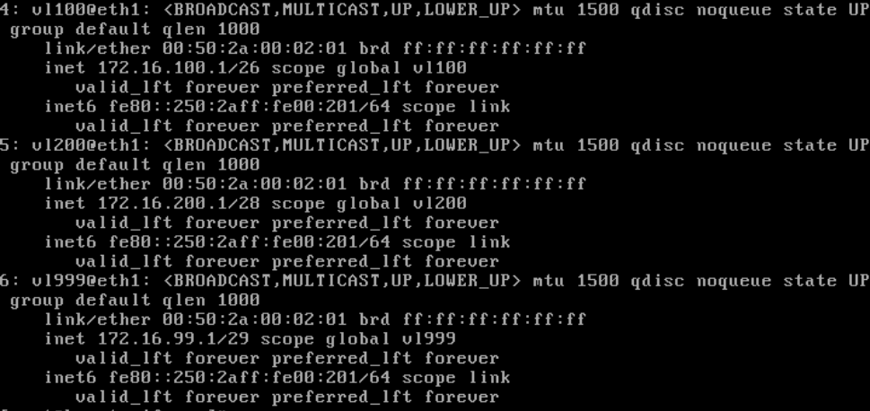

**Для HQ-SW**
Так-же как и до этого создаем директории для физических интерфейсов в /etc/net/ifaces/ а так же папку br0 в том же расположении

br0 имеет в себе файлы настроек со следующим содержимым:
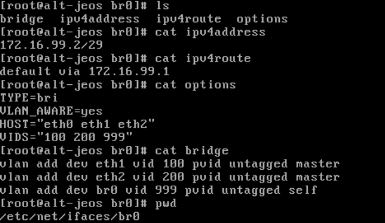

Теперь перезагружаем есть и пингуем каждый влан (172.16.100.1,172.16.200.1,172.16.99.1), они должны быть доступны.
## 5. Настройка безопасного удаленного доступа на серверах HQ-SRV и BR-SRV
Нужен днс и обновления репозитория

В файле /etc/openssh/sshd_config
```
Port 2024
AllowUsers sshuser
MaxAuthTries 2
Banner /etc/motd
```
В файле /etc/motd
```
Authorized access only
```
`systemctl enable --now sshd`

Проверять с помощью `ssh sshuser@172.16.100.2 -p 2024` и паролем P@ssw0rd
## 6. Между офисами HQ и BR необходимо сконфигурировать ip туннель
На HQ-RTR, для BR-RTR по аналогии но поменять местами tunlocal и tunremote и поставить адрес 10.0.0.2/30


## 7. Обеспечьте динамическую маршрутизацию: ресурсы одного офиса
должны быть доступны из другого офиса. Для обеспечения динамической
маршрутизации используйте link state протокол на ваше усмотрение.

Возможно понадобится поставить временный dns

Будем использовать OSPF, приступим к настройке и установке для HQ-RTR и по аналогии ставим так-же на BR-RTR:
>
`apt-get install frr -y
ospfd=yes в /etc/frr/daemons
systemctl enable frr --now`

**Переходим в консоль конфигурации frr**

Тут настройка по порядку:
```
vtysh

conf t
router ospf
network x.x.x.x area 0 (Все кроме wan)
passive-interface default
ex

interface tunnel
no ip ospf passive
ip ospf authentication
ip ospf authentication-key P@ssw0rd
do write
```
По аналогии делаем со вторым роутером, проверить через `show ip ospf neighbor` и если сосед появился то всё ок.

## 8. Настройка динамической трансляции адресов.
Настройте динамическую трансляцию адресов для обоих офисов.
На обоих роутерах сделать nat через iptables
>`
iptables -t nat -A POSTROUTING -o eth0 -j MASQUERADE
iptables-save >> /etc/sysconfig/iptables
`

## 9. Настройка протокола динамической конфигурации хостов.
>`
apt-get install dhcp-server -y
cd /etc/dhcp/
mv dhcpd.conf.sample dhcpd.conf
vim dhcpd.conf`

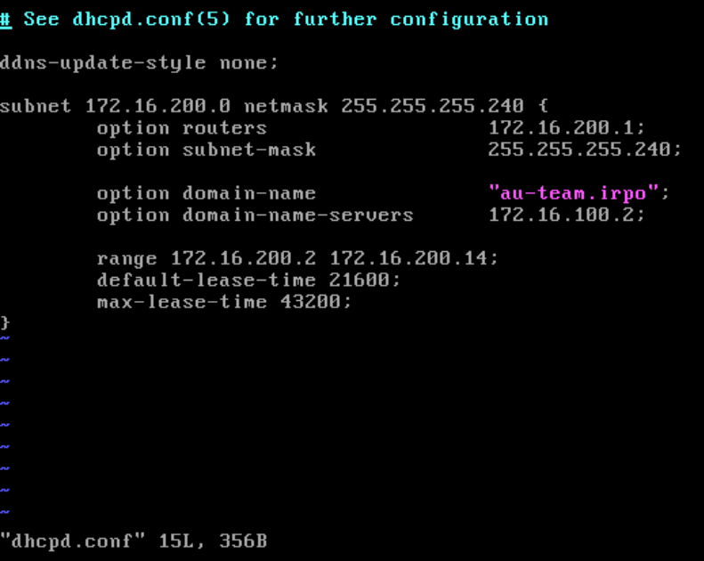
>`vim /etc/sysconfig/dhcpd
Отредактировать строку: DHSPDARGS=vl200
systemtctl enable --now dhcpd.service`

**На HQ-CLI**
>`systemctl restart network
Проверить - ip a `

Клиент должен получить айпи адрес т.к. стоит NetworkManager который по умолчанию включает dhcp клиент на интерфейсе
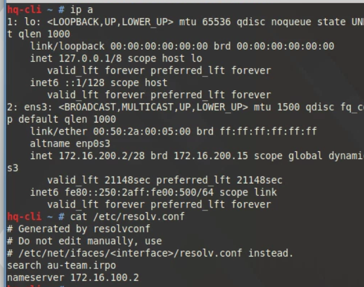

## 10. Настройка DNS для офисов HQ и BR.
**На HQ-SRV**
>`
apt-get install bind bind-utils -y
vim /etc/bind/options.conf`

В этом файле вносим изменения и раскомментируем параметры или пишем их сами:
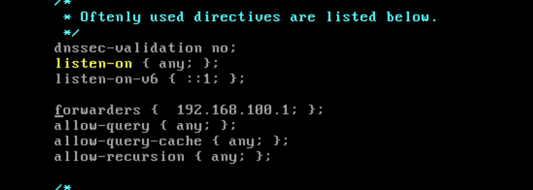
Добавляем зоны:
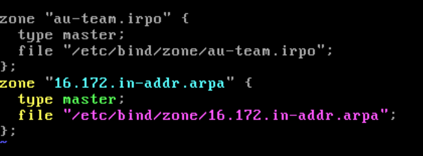
Создаем файлы зон и конфигурируем их:
>`
cd /etc/bind/zone
cp localhost au-team.irpo
cp localhost 16.172.in-addr.arpa
chown 777 ./*
`

Файл 17.172.in-addr.arpa
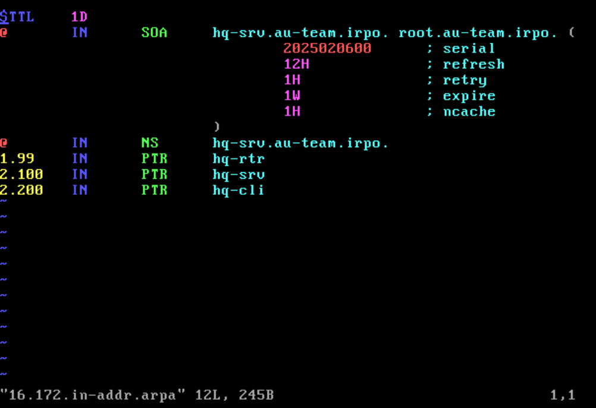
Файл au-team.irpo
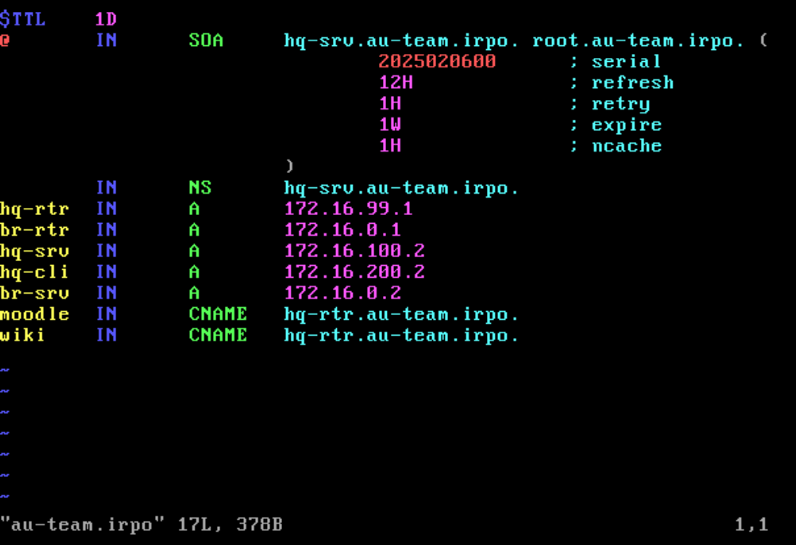
>`systemctl enable --now bind`

Теперь на всех устройствах можем установить этот днс сервер как основной для удобства.
Не забудьте, на **HQ-CLI** по заданию dns должен быть выдан через dhcp!
>`echo -e "nameserver 172.16.100.2\ndomain au-team.irpo" >> /etc/net/ifaces/lo/resolv.conf
systemctl restart network`

Примечание: 
- Eсли презагружали сеть, то требуется перезагрузить и bind тоже
- Eсли возникают ошибки с интерфейсом или ip адресом, то перезагрузить машину
- Проверить правильную работу днс можно через nslookup или более углубленно через dig
## 11. Настройте часовой пояс на всех устройствах, согласно месту проведения экзамена.
Требуется днс и возможно обновить репозиторий
>`
apt-get install glibc-timezones -y
timedatectl set-timezone Europe/Moscow
`