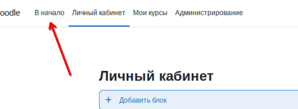
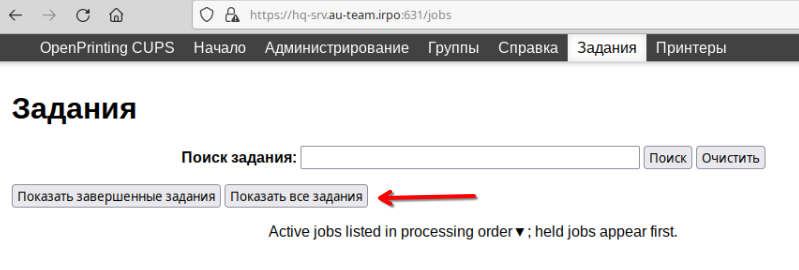

# Топология

# Модуль 1 
## Дополнительно:
В процессе настройки нам понадобится скачивать пакеты, и временно до того как настроим собственный днс сервер будем использовать общедоступный, в этой методичке днс сервер колледжа:
> `echo 'nameserver 192.168.100.1' >> /etc/resolv.conf`

Это временная настройка, после перезапуска сети или устройства она сотрется.

Если преднсатройка днс понадобится, то в параграфе будет об этом сказано

Так-же везде следует сразу же выполнить
> `apt-update`

при получении доступа в интернет и после прикручивания временного днс сервера, если этого не сделать иногда не удастся поставить пакеты

## 1. Произведите базовую настройку устройств
Настройте имена устройств согласно топологии. Используйте полное доменное имя.

На всех устройствах в соответствии с таблицей записей:

>`hostnamectl set-hostname hq-rtr.au-team.irpo`

IP-адрес должен быть из приватного диапазона, в случае, если сеть
локальная, согласно RFC1918

Локальная сеть в сторону HQ-SRV(VLAN100) должна вмещать не более 64 адресов
>`
Address:        172.16.100.1
Network:        172.16.100.0/26
Netmask:        255.255.255.192 = 26
Broadcast:      172.16.100.63
HostMin:        172.16.200.1
HostMax:        172.16.200.14
`

Локальная сеть в сторону HQ-CLI(VLAN200) должна вмещать не
более 16 адресов
>`
Address:        172.16.200.1
Network:        172.16.200.0/28
Netmask:        255.255.255.240 = 28
Broadcast:      172.16.200.15
HostMin:        172.16.200.1
HostMax:        172.16.200.14
`

Локальная сеть в сторону BR-SRV должна вмещать не более 32 адресов
>`
Address:        172.16.0.1
Network:        172.16.0.0/27
Netmask:        255.255.255.224 = 27
Broadcast:      172.16.0.31
HostMin:        172.16.0.1
HostMax:        172.16.0.30
`

Локальная сеть для управления(VLAN999) должна вмещать не
более 8 адресов
>`
Address:        172.16.99.1
Network:        172.16.99.0/29
Netmask:        255.255.255.248 = 29
Broadcast:      172.16.99.7
HostMin:        172.16.99.1
HostMax:        172.16.99.6
`

На всех устройствах необходимо сконфигурировать IPv4

Пример для HQ-SRV, на BR-SRV по аналогии


Настройка внешнего интерфейса к ISP на br-rtr, на hq-rtr так же но с другим адресом


## 2. Настройка ISP
В /etc/net/ifaces/options/eth0


Интерфейс к hq-rtr имеет такие настройки в файлах


Интерфейс к br-rtr


На ISP настройте динамическую сетевую трансляцию в сторону
HQ-RTR и BR-RTR для доступа к сети Интернет


Так-же в файле /etc/net/sysctl.conf должна быть следующая строка 
> `net.ipv4.ip_forward = 1`

После всей настройки перезагрузим сеть:
>`systemctl restart network`

## 3. Создание локальных учетных записей
Везде добавить временный днс сервер перед настройкой и обновить репозиторий
**На HQ-SRV и BR-SRV**
>`apt-get install sudo -y
useradd -u 1010 sshuser
usermod -aG wheel sshuser
passwd sshuser
Дважды вводим P@ssw0rd
В файле /etc/sudoers раскомментить строку WHEEL_USERS ALL=(ALL:ALL) NOPASSWD: ALL
Примечание: при редактировании через что либо кроме visudo этот файл - ro, чтобы его записать в виме введите :wq!
`

Чтобы проверить, выйдите из-под root и зайдите как sshuser с ранее прописанным паролем, затем введите `sudo -i` и привилегии должны быть повышены без запроса пароля
**На HQ-RTR и BR-RTR**
>`apt-get install sudo -y
useradd net_admin
usermod -aG wheel net_admin
passwd net_admin
Дважды вводим P@ssw0rd
В файле /etc/sudoers раскомментить строку WHEEL_USERS ALL=(ALL:ALL) NOPASSWD: ALL`

Проверка такая-же но входить как net_admin
## 4. Настройте на интерфейсе HQ-RTR в сторону офиса HQ виртуальный коммутатор:
На hq-rtr в соответствии с интерфейсами в ip a создайте папки в /etc/net/ifaces/ а так же папки для интерфейсов vlan


Интерфейсы vlan содержат соответсвующие настройки:

В соответсвии с назначением и айди влана поменяйте настройки в ipv4address и options (VID=VLAN_ID) для каждого вирутального интерфейса. Вот пример:

На HQ-RTR так-же нужно настроить в файле /etc/net/sysctl.conf 
> `net.ipv4.ip_forward = 1`

Перезагружаем сеть и выводим статус интерфейсов
>`
systemctl restart network
ip a
`

Должно выглядеть вот так:


**Для HQ-SW**
Так-же как и до этого создаем директории для физических интерфейсов в /etc/net/ifaces/ а так же папку br0 в том же расположении

br0 имеет в себе файлы настроек со следующим содержимым:


Теперь перезагружаем есть и пингуем каждый влан (172.16.100.1,172.16.200.1,172.16.99.1), они должны быть доступны.
## 5. Настройка безопасного удаленного доступа на серверах HQ-SRV и BR-SRV
Нужен днс и обновления репозитория

В файле /etc/openssh/sshd_config
```
Port 2024
AllowUsers sshuser
MaxAuthTries 2
Banner /etc/motd
```
В файле /etc/motd
```
Authorized access only
```
`systemctl enable --now sshd`

Проверять с помощью `ssh sshuser@172.16.100.2 -p 2024` и паролем P@ssw0rd
## 6. Между офисами HQ и BR необходимо сконфигурировать ip туннель
На HQ-RTR, для BR-RTR по аналогии но поменять местами tunlocal и tunremote и поставить адрес 10.0.0.2/30


## 7. Обеспечьте динамическую маршрутизацию: ресурсы одного офиса
должны быть доступны из другого офиса. Для обеспечения динамической
маршрутизации используйте link state протокол на ваше усмотрение.

Возможно понадобится поставить временный dns

Будем использовать OSPF, приступим к настройке и установке для HQ-RTR и по аналогии ставим так-же на BR-RTR:
>
`apt-get install frr -y
ospfd=yes в /etc/frr/daemons
systemctl enable frr --now`

**Переходим в консоль конфигурации frr**

Тут настройка по порядку:
```
vtysh

conf t
router ospf
network x.x.x.x area 0 (Все кроме wan)
passive-interface default
ex

interface tunnel
no ip ospf passive
ip ospf authentication
ip ospf authentication-key P@ssw0rd
do write
```
По аналогии делаем со вторым роутером, проверить через `show ip ospf neighbor` и если сосед появился то всё ок.

## 8. Настройка динамической трансляции адресов.
Настройте динамическую трансляцию адресов для обоих офисов.
На обоих роутерах сделать nat через iptables
>`
iptables -t nat -A POSTROUTING -o eth0 -j MASQUERADE
iptables-save >> /etc/sysconfig/iptables
`

## 9. Настройка протокола динамической конфигурации хостов.
>`
apt-get install dhcp-server -y
cd /etc/dhcp/
mv dhcpd.conf.sample dhcpd.conf
vim dhcpd.conf`


>`vim /etc/sysconfig/dhcpd
Отредактировать строку: DHSPDARGS=vl200
systemtctl enable --now dhcpd.service`

**На HQ-CLI**
>`systemctl restart network
Проверить - ip a `

Клиент должен получить айпи адрес т.к. стоит NetworkManager который по умолчанию включает dhcp клиент на интерфейсе


## 10. Настройка DNS для офисов HQ и BR.
**На HQ-SRV**
>`
apt-get install bind bind-utils -y
vim /etc/bind/options.conf`

В этом файле вносим изменения и раскомментируем параметры или пишем их сами:

Добавляем зоны:

Создаем файлы зон и конфигурируем их:
>`
cd /etc/bind/zone
cp localhost au-team.irpo
cp localhost 16.172.in-addr.arpa
chown 777 ./*
`

Файл 17.172.in-addr.arpa

Файл au-team.irpo

>`systemctl enable --now bind`

Теперь на всех устройствах можем установить этот днс сервер как основной для удобства.
Не забудьте, на **HQ-CLI** по заданию dns должен быть выдан через dhcp!
>`echo -e "nameserver 172.16.100.2\ndomain au-team.irpo" >> /etc/net/ifaces/lo/resolv.conf && systemctl restart network`

Примечание: 
- Eсли презагружали сеть, то требуется перезагрузить и bind тоже
- Eсли возникают ошибки с интерфейсом или ip адресом, то перезагрузить машину
- Проверить правильную работу днс можно через nslookup или более углубленно через dig
## 11. Настройте часовой пояс на всех устройствах, согласно месту проведения экзамена.
Требуется днс и возможно обновить репозиторий
>`
apt-get install glibc-timezones -y
timedatectl set-timezone Europe/Moscow
`
# Модуль 2
## 1. Настройте доменный контроллер Samba на машине BR-SRV.
>`
apt-get install samba-dc -y
rm -f /etc/samba/smb.conf
rm -f /etc/krb5.conf
samba-tool domain provision
Днс датабаза: BIND9_FLATFILE
Пароль администратора и пользователей - P@ssw0rd
samba-tool group add hq
samba-tool user add user<1-5>.hq P@ssw0rd
samba-tool group addmembers hq user<1-5>.hq
scp -P 2024 /var/lib/samba/bind-dns/dns/au-team.irpo.zone sshuser@172.16.100.2:/home/sshuser/bind9_flatfile
systemctl enable --now samba
`

Импорт пользователей:
>`cd /opt
vim import.sh`

Содержание import.sh
```
#!/bin/bash

CSVFILE="users.csv"
while IFS=',' read -r UN PW; do
    UN=$(echo $UN | xargs)
    PW=$(echo $PW | xargs)
    echo "Adding user: $UN with password: $PW"
    samba-tool user add "$UN" "$PW"
done < "$CSVFILE"
```
Запуск:
>`sh import.sh`

Пример успешного выполнения:


На **HQ-SRV**
Удалить все строки в файле /home/sshuser/bind9_flatfile до красной линии

И затем сделать 
>`cat bind9_flatfile >> /etc/bind/zone/au-team.irpo
systemctl restart bind
`

На **HQ-CLI**

Меню > Центр управления > Центр управления системой > Ввести пароль для root > Аутентификация > Домен Active Directory
Нажать "Применить" и ввести пароль для Administrator (P@ssw0rd)
Перезагрузить компьютер и попробовать войти под одним из пользователей домена

Реализуем повышение привелегий для пользоваталей группы hq, выполнять из-под root
>`apt-get install sudo
echo "%hq  ALL=(ALL) NOPASSWD: /bin/grep,/usr/bin/id,/bin/cat" >> /etc/sudoers
chmod 4755 /usr/bin/sudo
`

Проверка: зайти под одним из пользователей домена и прописать `sudo id`, в начале вывода строки должно показать uid=0(root)

## 2. Сконфигурируйте файловое хранилище
На **HQ-SRV**
Введем `lsblk` чтобы посмотреть диски в системе
>`
Используем свободные диски по 1 гигу.
mdadm --create /dev/md0 --level=5 --raid-devicces=3 /dev/vdb /dev/vdc /dev/vdd
mkfs.ext4 /dev/md0
mkdir /raid5
cat /proc/mdstat - Ждём пока завершится сборка
mdadm --detail --scan >> /etc/mdadm.conf
vim /etc/fstab`

Между элементов - табы
```
/dev/md0	/raid5	ext4	defaults	0	0
```
Настроим nfs
>`
apt-get install rpcbind nfs-server -y
mkdir /raid5/nfs
systemtl enable --now nfs
vim /etc/exports
`
```
/raid5/nfs 172.16.200.0/28(no_root_squash,subtree_check,rw)
```
`exportfs -ra`
На **HQ-CLI**
От root
>`
mkdir /mnt/nfs
vim /etc/fstab
`

Между элементами - табы
```
hq-srv:/raid5/nfs	/mnt/nfs	nfs	defaults	0	0
```
Для проверки - от root
>`
reboot
mount | grep nfs
touch /mnt/nfs/icanwrite`

Раздел должен быть в выдаче grep как примонтированный и должна быть возможность записи на него
## 3. Настройте службу сетевого времени на базе сервиса chrony
На **HQ-RTR**
>`
apt-get install chrony -y
vim /etc/chrony.conf
`

Пропишем следующие настройки:
```
#pool <POOL> iburst
allow all
local stratum 5 
```
>`systemctl restart chrony`

На **HQ-SRV, HQ-CLI, BR-RTR, BR-SRV**
>`
apt-get install chrony -y
vim /etc/chrony.conf
`

Пропишем следующие настройки:
```
pool 172.16.99.1 iburst
```
>`systemctl restart chrony
chronyc makestep
chronyc sources`

Stratum должен быть 5, и статус нашего NTP сервера - ^*
## 4. Сконфигурируйте ansible на сервере BR-SRV
Преднастройка машин от root:
На **HQ-RTR, BR-RTR, CLI-HQ**
>`
systemctl enable --now sshd
`

На **HQ-SRV**
>`apt-get install -y python3`

Настройка Ansible на **BR-SRV**
>`
apt-get install -y ansible
cd /etc/ansible
`

В файле ansible.cfg раскоментируем строку `host_key_checking = False`

Файл hosts должен иметь следующее содержание:


Проверка:
>`ansible -m ping all`

Должно вывести:


## 5. Развертывание приложений в Docker на сервере BR-SRV.
>`
apt-get install -y docker-engine docker-compose
ln /usr/lib/docker/cli-pluigns/docker-compose /bin/
systemcl enable --now docker
cd /root
vim wiki.yml
`

Запишем в файл следующее:


Поднимем контейнеры и настроим способ аутентификации для пользователя wiki:
>`
docker-compose -f wiki.yml up -d
systemctl enable --now sshd
`

На **HQ-CLI**
Через браузер открываем 172.16.0.2:8080

Ставим русский язык

~~Внимательно читаем условия~~ Проматываем вниз и соглашаемся со всем

Заполняем данные для MariaDB

Жмём далее

Почти готово, вводим оставшиеся данные


Вас перебросит на эту страницу и автоматичеки скачается файл с настройками, если он не скачался нажмите `Загрузить`


Теперь отправляем этот файл на BR-SRV
>`scp -P 2024 LocalSettings.php sshuser@br-srv:/home/sshuser/`

На **BR-SRV**
>`
mv /home/sshuser/LocalSettings.php /root/
docker-compose -f wiki.yml down
vim wiki.yml`

Раскомментируем строку (убрать символ #)
```
#- ./LocalSettings.php:/var/www/html/LocalSettings.php
```
Поднимем контейнер
>`
docker-compose -f wiki.yml up -d`

На **HQ-CLI**
Немного ждём и обновляем страницу, видим что вики теперь работает


На **BR-SRV**
Если вы что-то настроили не так и нужно сбросить контейнеры, используйте:
>`docker-compose -f wiki.yml down -v`

## 6. На маршрутизаторах сконфигурируйте статическую трансляцию портов
На **BR-RTR**
>`
iptables -t nat -A PREROUTING -p tcp -i eth0 --dport 80 -j DNAT --to-destination 172.16.0.2:8080
iptables-save >> /etc/sysconfig/iptables
iptables -t nat -A PREROUTING -p tcp -i eth0 --dport 2024 -j DNAT --to-destination 172.16.0.2:2024
iptables-save >> /etc/sysconfig/iptables
`

Проверяем работу Wiki с HQ-CLI
В браузере открываем 172.16.5.2:80

Проверяем работу ssh с HQ-RTR
>`ssh sshuser@172.16.5.2 -p 2024`


На **HQ-RTR**
>`
iptables -t nat -A PREROUTING -p tcp -i eth0 --dport 2024 -j DNAT --to-destination 172.16.100.2:2024
iptables-save >> /etc/sysconfig/iptables
`

Проверяем с BR-RTR
>`
ssh sshuser@172.16.4.2 -p 2024
`

## 7. Запустите сервис moodle на сервере HQ-SRV
>`
apt-get install -y moodle-local-mysql moodle moodle-apache2 mariadb-server
systemctl enable --now httpd2.service mysqld.service
mariadb -u root
CREATE DATABASE moodledb DEFAULT CHARACTER SET utf8mb4 COLLATE utf8mb4_unicode_ci;
CREATE USER 'moodle'@'localhost' IDENTIFIED VIA mysql_native_password USING PASSWORD('P@ssw0rd');
GRANT ALL PRIVILEGES ON moodledb.* TO 'moodle'@'localhost';
FLUSH PRIVILEGES;
exit
vim /etc/php/8.2/apache2-mod_php/php.ini
`

Раскомментируем и приводим к нужному виду:
```
max_input_vars = 5000
```
>`systemctl restart httpd2.service`

На **CLI-HQ**
В браузере откроем http://172.16.100.2/moodle


Ждём и проматываем вниз

Заполняем данные





Проматываем вниз

Ставим такие параметры если они не установились сами

Проматываем вниз

Выключаем режим редактирования

Нажимаем везде "В начало"

Настройка завершена

## 8. Настройте веб-сервер nginx как обратный прокси-сервер на HQ-RTR
>`
apt-get install nginx -y
vim /etc/nginx/sites-available.d/default.conf`

Заполняем так:


>`
ln /etc/nginx/sites-available.d/default.conf /etc/nginx/sites-enables.d/
systemctl enable --now nginx.service`

Проверяем с HQ-CLI

В браузере открываем страницы

`
http://moodle.au-team.irpo/moodle
http://wiki.au-team.irpo
`
# Модуль 3
## 2. ПОЧИНИТЬ Выполните настройку центра сертификации на базе HQ-SRV

>`
apt-get install -y openssl openssl-gost-engine
control openssl-gost enabled
openssl genpkey -algorithm gost2012_256 -pkeyopt paramset:A -out /etc/pki/CA/private/ca.key
openssl req -x509 -md_gost12_256 -new -key /etc/pki/CA/private/ca.key -days 365 -out /etc/pki/CA/certs/ca.crt
В Common Name вводим: SelfCert
openssl genrsa -out web.key 4096
openssl req -key web.key -new -out web.csr
В Common Name вводим: *.au-team.irpo
vim openssl.cnf
`

Запишем в файл:
```
[req]
req_extensions = req_ext

[req_ext]
subjectAltName = DNS:wiki.au-team.irpo, DNS:moodle.au-team.irpo
extendedKeyUsage = serverAuth
keyUsage = digitalSignature
```

>`
scp pki/ca.crt user@hq-cli:/home/user

scp pki/issued/web.crt net_admin@hq-rtr:/home/net_admin

scp pki/private/web.crt net_admin@hq-rtr:/home/net_admin
`

На **HQ-RTR**
>`
mkdir /etc/ssl/certs -p
mv /home/net_admin/web* /etc/ssl/certs/
vim /etc/nginx/sites-available.d/default.conf`


>`systemctl restart nginx`

На **HQ-CLI**
>`mv /home/user/car.cr /etc/pki/ca-trust/source/anchors/
update-ca-trust
`

Проверить открыв https://wiki.au-team.irpo, если нет предупреждений то всё сработало


## 5. Настройте принт-сервер cups на сервере HQ-SRV.
>`
apt-get install -y cups cups-pdf
cupsctl --remote-admin --remote-any --share-printers
`

На **HQ-CLI**
От root
>`
lpadmin -p Cups-PDF -E -v ipp://hq-srv:631/printers/Cups-PDF -m everywhere
lpoptions -d Cups-PDF
echo "Test print job" | lp -d Cups-PDF
`

В браузере откроем
https://hq-srv.au-team.irpo:631/jobs

Если задание появилось, то всё настроено правильно.
## 6. Реализуйте логирование при помощи rsyslog на устройствах HQ-RTR, BR-RTR, BR-SRV

На **HQ-SRV**
>`
apt-get install -y rsyslog-classic
vim /etc/rsyslog.d/00_common.conf
rm -f /etc/rsyslog.d/10_classic.conf
`
```
Раскомментировать строки
module(load="imudp") # needs to be done just once
input(type="imudp" port="514")

module(load="imtcp") # needs to be done just once
input(type="imtcp" port="514")

Добавить в конец файла
$template RemoteLogs, "/opt/%HOSTNAME%/%HOSTNAME%.log"
*.* ?RemoteLogs
& ~
```

>`
systemctl enable --now rsyslog`

На **HQ-RTR, BR-RTR, BR-SRV**

>`
apt-get install -y rsyslog-classic
vim /etc/rsyslog.d/00_common.conf
`
```
Раскомментировать
module(load="imjournal") # provides support for systemd-journald logging
module(load="imuxsock")  # provides support for local system logging (e.g. via logger command)
module(load="imklog")    # provides kernel logging support (previously done by rklogd)
module(load="immark")    # provides --MARK-- message capability

Добавить в конец файла
*.warning @@hq-srv:514
```
>`
systemctl enable --now rsyslog`

На **HQ-SRV**
Проверим что логи присылаются `ls /opt`
Настроим ротацию
>`vim /etc/logrotate.d/rsyslog`


>`
EDITOR=vim crontab -e
Введите:
0 0 * * 0 /usr/sbin/logrotate -f /etc/logrotate.d/rsyslog
Выйти из vim :wq
`

Проверим работу:
>`logrotate -d /etc/logrotate.d/rsyslog`

Должно быть выведено, что слишком рано для ротации т.к. логи не достигли нужного размера файла

## 8. Реализуйте механизм инвентаризации машин HQ-SRV и HQ-CLI через Ansible на BR-SRV:
>`
mkdir /etc/ansible/PC_INFO
vim /etc/ansible/PC_INFO/playbook.yml
`


>`ansible-playbook /etc/ansible/PC_INFO/playbook.yml`

Если всё успешно, в папке PC_INFO появятся два файла с отчетом о машинах

Дополнительно если что-то не так, для отладки синтаксиса плейбука можно использовать пакет и утилиту ansible-lint

## 9. Реализуйте механизм резервного копирования конфигурации для машин HQ-RTR и BR-RTR, через Ansible на BR-SRV

>`
mkdir /etc/ansible/NETWORK_INFO
vim /etc/ansible/net.yml`


На **BR-RTR, HQ-RTR**
>`
chmod -R 777 /etc/frr
chmod o+r /etc/sysconfig /etc/sysconfig/iptables 
chmod -R o+r /etc/net/ifaces/
`

На **HQ-RTR**
>`
chmod -R 777 /etc/dhcp
`

На **BR-SRV**
>`ansible-playbook /etc/ansible/net/yml`

Для проверки смотрим папку /etc/ansible/NETWORK_INFO
